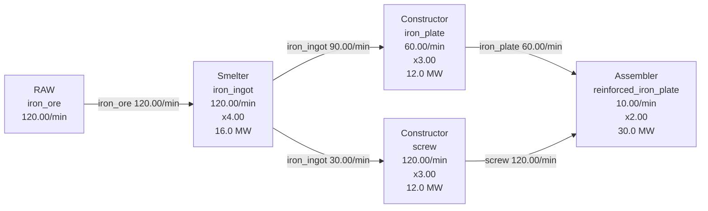

```mermaid
flowchart LR
 id_reinforced_iron_plate["Assembler<br/>reinforced_iron_plate<br/>10.00/min<br/>x2.00<br/>30.0 MW"]
 id_iron_plate["Constructor<br/>iron_plate<br/>60.00/min<br/>x3.00<br/>12.0 MW"]
 id_iron_ingot["Smelter<br/>iron_ingot<br/>120.00/min<br/>x4.00<br/>16.0 MW"]
 id_iron_ore["RAW<br/>iron_ore<br/>120.00/min"]
 id_screw["Constructor<br/>screw<br/>120.00/min<br/>x3.00<br/>12.0 MW"]
  id_iron_plate -->|iron_plate 60.00/min| id_reinforced_iron_plate
  id_iron_ingot -->|iron_ingot 90.00/min| id_iron_plate
  id_iron_ore -->|iron_ore 120.00/min| id_iron_ingot
  id_screw -->|screw 120.00/min| id_reinforced_iron_plate
  id_iron_ingot -->|iron_ingot 30.00/min| id_screw
```