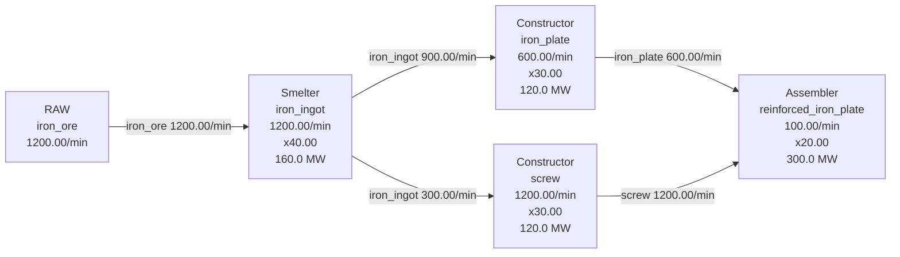

```mermaid
flowchart LR
  id_reinforced_iron_plate["Assembler<br/>reinforced_iron_plate<br/>100.00/min<br/>x20.00<br/>300.0 MW"]
  id_iron_plate["Constructor<br/>iron_plate<br/>600.00/min<br/>x30.00<br/>120.0 MW"]
  id_iron_ingot["Smelter<br/>iron_ingot<br/>1200.00/min<br/>x40.00<br/>160.0 MW"]
  id_iron_ore["RAW<br/>iron_ore<br/>1200.00/min"]
  id_screw["Constructor<br/>screw<br/>1200.00/min<br/>x30.00<br/>120.0 MW"]
  id_iron_plate -->|iron_plate 600.00/min| id_reinforced_iron_plate
  id_iron_ingot -->|iron_ingot 900.00/min| id_iron_plate
  id_iron_ore -->|iron_ore 1200.00/min| id_iron_ingot
  id_screw -->|screw 1200.00/min| id_reinforced_iron_plate
  id_iron_ingot -->|iron_ingot 300.00/min| id_screw
```